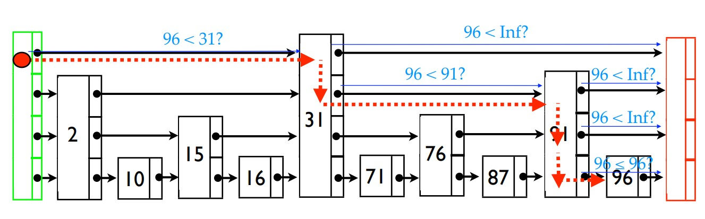
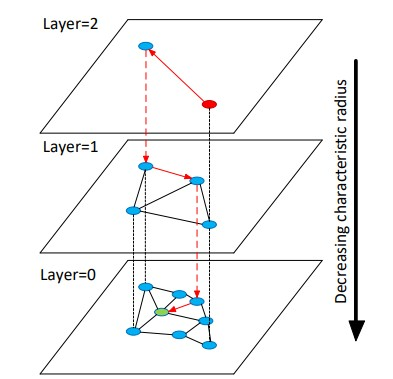

# Grafovi za prepoznavanje i pretragu sličnih entiteta

Potreba za pronalaženjem sličnih entiteta u velikim skupovima podataka je prisutna u mnogim oblastima, poput preporučivanja proizvoda, pretraživanja teksta, ili pretraživanja sličnih slika (npr. kada korisnik želi da pronađe slike koje su slične onoj koju je uneo).

Kako bi se efikasno izvršila pretraga nad velikom količinom podataka, tokom godina su razvijane različite metode i korišćene različite strukture podataka. Ovde će biti predstavljeni HNSW grafovi i KNN pretraga nad njima. Biće prikazana pretraga nad skupom slika, sa ciljem prepoznavanja osoba na osnovu njihovih slika lica.

## Predstavljanje podataka

Sliku lica je prvo potrebno predstaviti u nekom prostoru koji je niže dimenzije, a u kom je moguće zadržati sve informacije koje su neophodne za prepoznavanje. Na primer, moguće ih je predstaviti kao vektore realnih brojeva. Za te potrebe se koriste neuronske mreže koje su obučene da izdvajaju bitne karakteristike slike (*eng. feature embeddings*). Neki od javno dostupnih modela za izdvajanje bitnih karakteristika lica su: [SphereFace](https://arxiv.org/abs/1704.08063), [CosFace](https://arxiv.org/abs/1801.09414), [FaceNet](https://arxiv.org/abs/1503.03832), [ArcFace](https://arxiv.org/abs/1801.07698), [VGGFace](https://www.robots.ox.ac.uk/~vgg/publications/2015/Parkhi15/parkhi15.pdf), [DeepFace](https://www.cs.toronto.edu/~ranzato/publications/taigman_cvpr14.pdf).

Za potrebe ovog primera je uzeta varijanta FaceNet-a koja konvertuje sliku 512-dimenzioni vektor -- $ x_i \in \R^{512} $.


## KNN pretraga

Algoritami za pretragu koji se najčešće koriste se oslanjaju na algoritam pretrage K najbližih suseda (KNNS - *K-Nearest Neighbor Search*). KNN pretraga podrazumeva da je definisana funkcija na osnovu koje može da se meri rastojanje između elemenata koji se pretražuju. 

Za određivanje distance između vektorskih reprezentacija dve slike lica, najčešće se koristi kosinusna distanca. Kosinusna distanca između dva vektora se računa kao kosinus ugla između njih. Definisana je kao:

$$ 
\begin{equation}
\begin{split}
cos\_distance & = 1 - cos\_similarity \\
              & = 1 - cos(\theta) \\
              & = 1 - \frac{A \cdot B}{||A|| ||B||} \\
              & = 1 - \frac{\sum\limits_{i=1}^{n}A_i B_i}{\sqrt{\sum\limits_{i=1}^{n}A_i^n} \sqrt{\sum\limits_{i=1}^{n}B_i^n}}
\end{split}
\end{equation}
$$

gde su $A$ i $B$ vektori koji odgovaraju slikama koje se porede, a $\theta$ ugao između njih.

Geometrijski, ovo se može prikazati na sledeći način (u dvodimenzionom slučaju):

  

*Slika 1: a) Leva: ugao između vektora je veći, što znači da su oni međusobno dalji i da su slike kojima odgovaraju manje slične. b) Desno:  ugao između vektora je manji, što znači da su oni međusobno bliži i da su slike kojima odgovaraju sličnije.*

Kosinusna distanca je uvek u intervalu $[0, 2]$, a što je manja, to su slike sličnije. Ukoliko su slike identične, kosinusna distanca je 0, a ukoliko su slike potpuno različite, kosinusna distanca je 2.

Alternativno, može se koristiti i L2 norma.

Naivni pristup KNN pretrage se zasniva na tome da se za svaki element iz skupa podataka izračuna rastojanje od svih ostalih elemenata, i da se zatim izabere $K$ elemenata koji su najbliži datom elemntu. Nažalost, složenost ovog pristupa raste linearno sa porastom broja elementata u skupu podataka, čineći ga neupotrebljivim za realne primene. Zbog toga se koriste različite strukture podataka koje omogućavaju bržu pretragu, kao i aproksimacije pretrage.


## Aproksimativna KNN pretraga pomoću HNSW grafova

HNSW (*Hierarchical Navigable Small World*) graf predstavlja *state-of-the-art* strukturu podataka za aproksimativnu KNN pretragu. HNSW grafovska je struktura podataka koja se sastoji iz više nivoa. 

HNSW uzima koncept pretrage od *skip* listi. 

## *Skip* lista

*Skip* lista je struktura podataka koja omogućava brzu pretragu, a sastoji se od više nivoa. Viši nivoi sadrže manje elementata, između kojih su uspostavljene duže konekcije. Kako se spuštamo na niže nivoe, broj elemenata raste, a konekcije postaju kraće. Najniži nivo sadrži sve elmente originalne liste. Primer *skip* liste se može videti na sledećoj slici:


Pretraga za nekim elemntom *k* počinje od najvišeg nivoa. Kada nađemo element koji je veći od *k*, vraćamo se na prethodni manji element, spuštamo se na niži nivo, i nastavljamo pretragu od tog elementa. Ovaj postupak ponavljamo sve dok se ne pronađe traženi element.

Pseudokod za pretragu izgleda ovako:
```
When search for k:
 If k = key, done!
 If k < next key, go down a level
 If k ≥ next key, go right
```

Ovime se postiže da složenost pretrage bude *O(log n)*, umesto *O(n)* kakav je slučaj sa običnim listama, s tim što se prostorna složenost poveća sa *O(n)* na *O(n log n)* . *Skip* liste su primenljive samo nad sortiranim listama.

Primer jedne *skip* liste i pretrage za brojem 96 je prikazan na sledećoj slici:



Dodavanje novih elmenata se određuje probabilistički. Za svaki novi element prvo moramo da odredimo nivo na koji ćemo ga dodati. Verovatnoća izbora najvišeg nivoa je uvek najmanja, dok se verovatnoća izbora svakog narednog nivoa povećava. Opšte pravilo je da će se elemnt koji se nalazi na nekom nivou *l*, pojaviti na nivou iznad njega (*l+1* nivou) sa nekom predefinisanom verovatnoćom *p*. A takođe važi i sledeće: Ako je element dodat na nivo *l*, znači da će biti dodat i na sve nivoe ispod njega (*l-1, l-2, itd*).

## HNSW graf

Sličan koncept se primenjuje i pri kreiranju i pretrazi HNSW grafa. On se takođe sastoji iz više nivoa, s tim što se na svakom nivou umesto liste nalazi graf. Primer HNSW grafa se može videti na sledećoj slici:



Čvorovi grafa predstavljaju *feature* vektore koji odgovaraju slikama lica. A grane kojima su čvorovi povezani odgovaraju kosinusnim distancama između tih vektora.

### Pretraga HNSW grafa

Pretraga se odvija po sledećem principu:

1. Pretraga počinje od slučajno odabranog čvora na najvišem nivou. Najviši nivo ima najmanje čvorova i najduže veze između njih, dok svaki naredni sloj ima sve više čvorova i sve kraće veze. 

2. Najviši sloj se pretražuje sve dok se ne pronađe lokalni minimum, odnosno čvor (vektor) koji ima najmanju distancu od traženog čvora (vektora).

3. Nakon što se pronađe lokalni minimum, pretraga se nastavlja na narednom (nižem) sloju, od čvora koji je predstavljao lokalni minimum na prethodnom sloju.

4. Postupak se ponavlja sve dok se ne dođe do najnižeg sloja, kada se vraća *K* suseda najbližih traženom čvoru.

Ako je maksimalan broj konekcija po čvoru na svakom od slojeva konstantan, složenost pretrage je *O(log n)*, gde je *n* broj čvorova u grafu.

Pre nego što krenemo u detaljniju analizu procesa kreiranja i pretrage grafa, definišimo neke od osnovnih parametara koji se koriste:

* *ef_search* - određuje broj čvorova koji će se pretraživati na svakom nivou. Što je ovaj broj veći, pretraga će biti preciznija, ali sporija.

* *ef_construction* - određuje broj čvorova koji će se pretraživati prilikom kreiranja grafa. Što je ovaj broj veći, graf koji se kreira će biti precizniji, ali će kreiranje trajati duže. Idealno, ova vrednost treba da bude dovoljno velika da bi *recall* KNN pretrage bio što bliži 1.

* $m_L$ - maksimalan broj konekcija po čvoru na svakom od slojeva. Što je ovaj broj veći, pretraga će biti preciznija, ali sporija i graf će zauzimati više memorije.

### Kreiranje HNSW grafa

Insertovanje elemenata u HNSW graf se odvija po sledećem principu:

* Za svaki elemnt koji se insertuje se prvo odredi maksimalni sloj *l* na kom će se nalaziti. To se radi probabilistički -- *l* se bira iz eksponencijalno opadajuće raspodele (normalizovane $m_L$ parametrom).

    $$l = -ln(unif(0..1)) * m_L$$

* Pretraga počinje od najvišeg sloja.

* Pohlepnom pretragom (koja je opisana algoritmom 2 (TODO)) se pronalazi *ef = ef_construction* najbližih suseda čvora *q* koji se trenutno insertuje.

* Zatim se pretraga nastavlja u narednom sloju, počevši od najbližih suseda pronađenih u prethodnom nivou. 

* Prethodna dva koraka se ponavljaju dok se ne ispuni kriterijum zaustavljanja.

Prilikom pretrage se čuva dinamička lista *W* koja sadrži *ef* najbližih suseda. Lista se u svakom koraku ažurira na osnovu evaluacije suseda elemenata liste koji su prethodno dodati. Kada se lista dostigne maksimalnu veličinu od *ef* elemenata, ako se naidje na element koji je bliži traženom čvoru od najdaljeg elementa liste, taj najdalji element će biti zamenjen njime. Kada se evaluiraju sva susedstva elemenata liste, pretraga se završava. 

Prednost ovakvog kriterijuma zaustavljanja je u tome što neće evaluirati sve čvorove grafa, već će odbacivati sve one koji se od traženog čvora nalaze dalje od najdaljeg elementa liste *W*.

